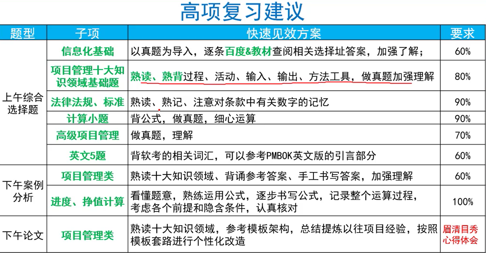
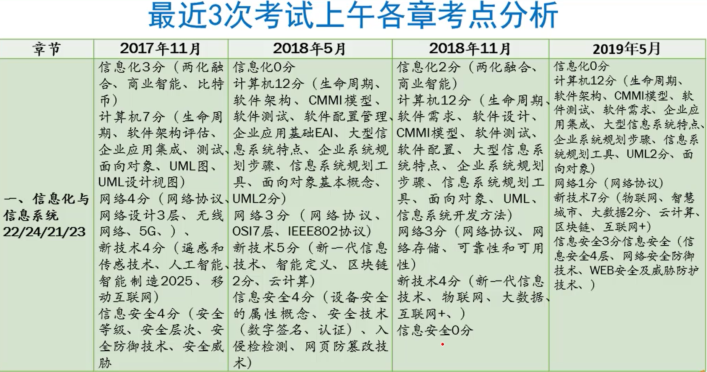
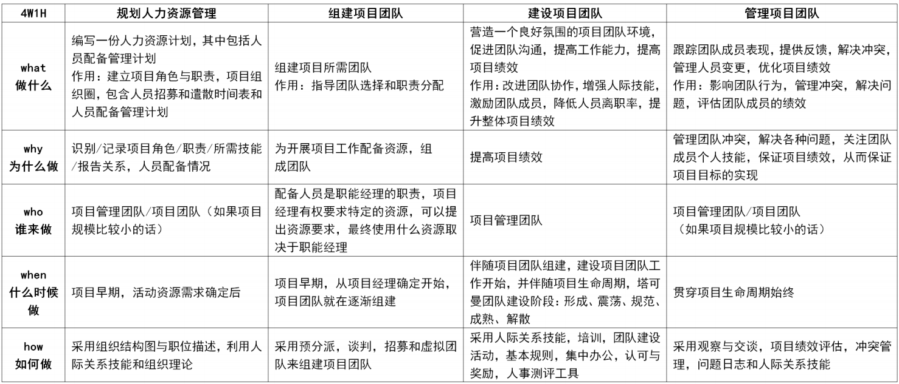
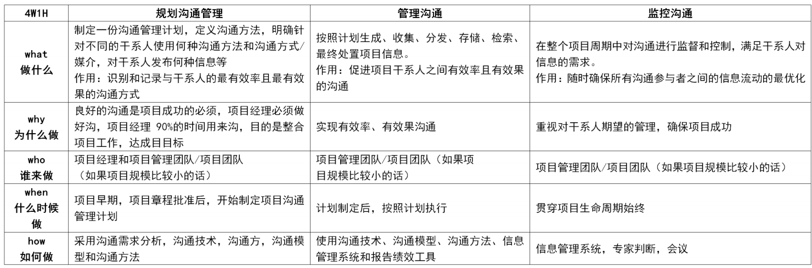
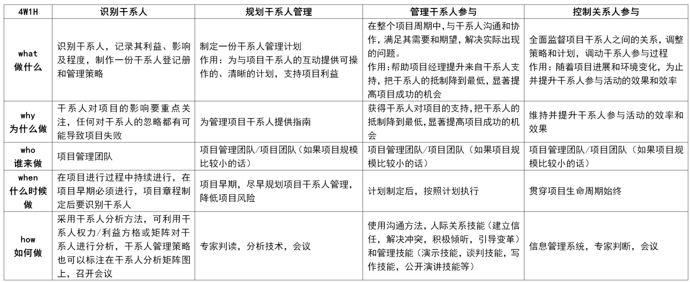
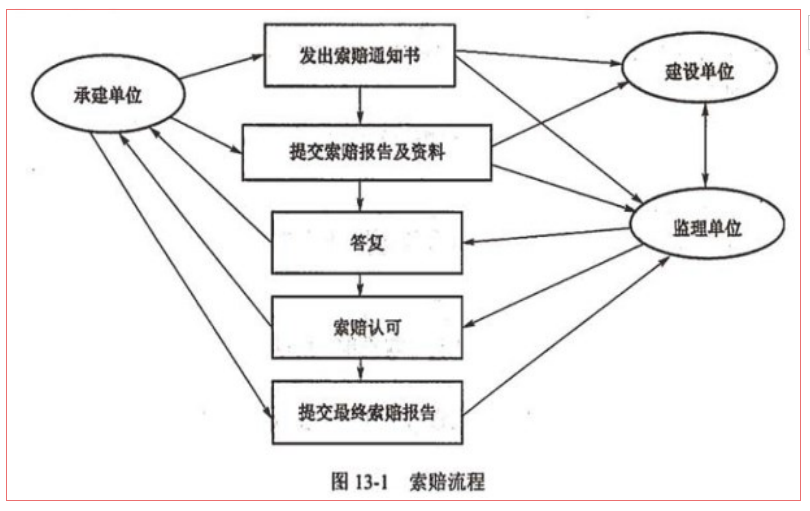
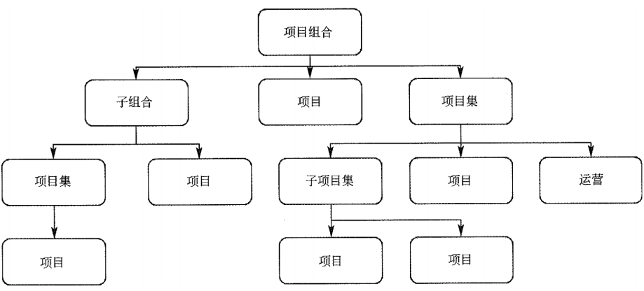
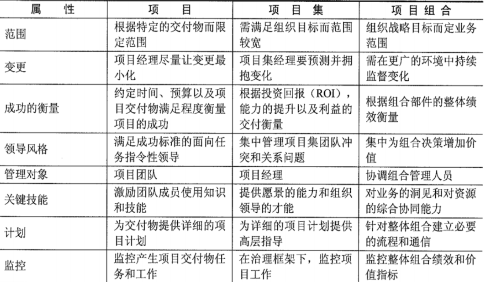
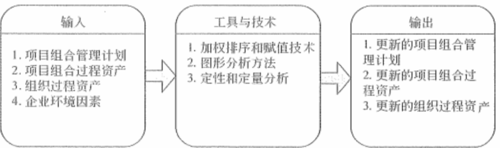
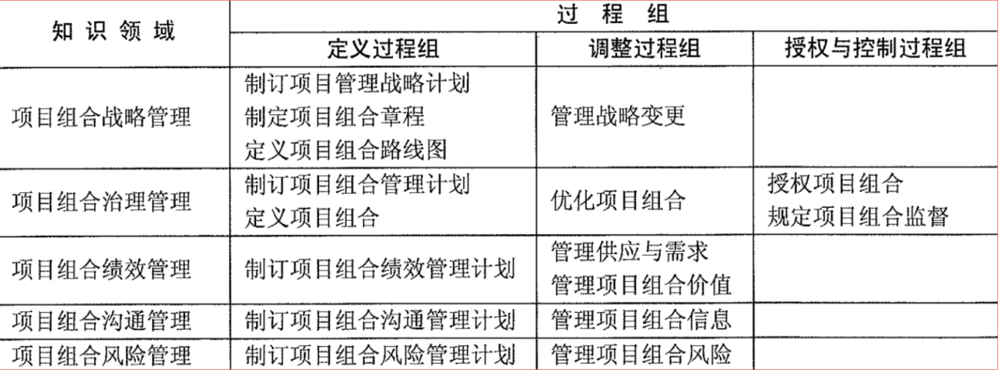

### 复习侧重点

### 教程提炼大纲

△了解；☆掌握；★背诵

#### 第一章 信息化与信息系统

#### 第二章 信息系统项目基础

#### 第三章 项目立项管理

材料重点

- 了解甲方（7点）和乙方（8点）立项的基本流程？
- 项目立项的基本内容？（6点）
- 什么是项目建议书？核心内容是什么？（4点）
- 一般立项，可行性研究的主要内容？（7点）
- 招标项目的约束？招标人的约束？招标的分类？
- 投标的流程？（3点）招标投标法？时间？存放？
- 评标委员会构成、规定？评标标准？
- 中标后，招标人和投标人要做些什么？
- **信息系统项目**的可行性研究内容？（4点）★
  - 技术可行性要考虑的因素？（4点）★
  - 经济可行性要考虑的因素？（4点）★

- 可行性研究分为哪几个阶段？（3点）
- 初步可行性研究的大概内容？主要产出？
- 详细可行性研究除了和初步可行性研究的结果和主要内容类似外，主要差异是什么？（细节）★
- 辅助研究的主要描述？（2点）
- 投资前期的4个阶段？评估与决策的依据？
- 现代项目管理的基本原则？
- 项目论证的前提、手段和核心？
- 项目论证分为哪三个阶段？每个阶段的基本内容？
- 项目论证分为哪两种？论证的主要步骤？（7点，明->收集->拟定->多比较->选择最好->编报告->写计划）
- 项目论证和项目评估的关系和区别？（3点）
- 项目评估是一个怎样的过程？评估依据？产出是什么？
- 项目评估的主要步骤？（7点，成立->收集和评审->分析和评估->编写报告->讨论报告->专家论证->评估定稿）

案例分析储备记忆要点

- 新产品研发项目的管理过程中存在什么问题？（11点）
- 公司应该吸取什么教训？（6点）
- 公司对该新产品的研发日后可采取哪些补救或改进措施？（3点）
- 甲方立项管理存在的问题？（6点）
- 乙方立项管理存在的问题？（7点）

#### 第四章 项目整体管理★

本章结合第16章 变更管理，内容包括整体、变更、收尾管理。此部分上午考5-6分，案例论文都有，**是复习重点章节**。

- 10大知识领域？巧记
  - 每个管理有哪几个过程？定义？
  - 每个过程的输入和输出、工具和技术是什么？
  - 每个管理可能遇到的问题？**怎么解决**？**案例分析**
  - 各个管理之间的联系？
  - 充分重视教程中的图、表，还有举例！
  - 如果出案例，可能会考哪些方面的知识点！
- 项目管理的3从4得是指什么？了解一下什么意思
- **什么是项目整体管理**（6个执行过程，男孩追求女孩的例子）？★
- 项目章程的一些注意事项：
  - 项目经理最好在计划启动之前委派，因为项目经理应该参与制定项目章程。★
  - 项目实施组织外部签发，不是项目经理本人（比如发起人、项目管理办公室或项目组合指导委员会）★
- 项目章程的作用？（4点）
- 项目章程的内容描述？（10点）★
- 项目工作说明书的内容？（3点）扩展：采购工作说明书、范围工作说明书内容？
- 事业（企业）环境因素的内容？（8点）
- 组织过程资产的内容？
  - 过程和程序（10点）
  - 全部知识（6点）
- 事业环境因素和组织过程资产的区别？
- 项目财务价值评价方法以及各自的计算方式？（3个）★
- 项目目标的特点？（2点）
- 引导技术可以用来帮助团队和个人完成项目活动的关键技术，包含哪些方法？（4点等）
- NPV净现值（Net Present Value，考虑了风险）、EPV预期现值、IRR(Internal Rate of Return)内部收益率、Payback(回收期)的概念？
- 项目管理计划的主要内容？（13个子计划、3个基准、其他、11个阶段工作方式方法、2个补充原则）★
- 制定项目计划通常存在的问题有哪些？（7点，案例分析）★
- 指导与管理项目执行？
  - （变更）纠正措施、预防措施、缺陷补救 ★ 
  - 整体协调应采取的行动（8点）了解
  - 三类会议 了解
- 项目绩效：
  - 团队绩效评价（建设团队的输出）对人 团队
  - 项目绩效评估（管理团队的工具）对人 个人
  - 工作绩效数据（执行的输出）对事
  - 工作绩效信息（各控制过程输出）对事
  - 工作绩效报告（监控的输出）对事
- 整体变更控制过程包括哪些管理活动？（10点）
- 配置管理活动包括哪些？（3点）
- 结束项目或阶段的一般流程？
- 收尾过程组：
  - 结束项目或阶段（项目收尾）7点
  - 结束采购（合同收尾）5点
- 项目收尾管理工作包括哪些？（4点）★ 
- 系统集成项目在验收阶段包括哪些？（4点）★ 
  - 包含哪些文档？（5个）★ 
- 收尾管理中的项目总结的意义是什么？（4点）★ 
- 项目总结会议讨论的内容？（7点）★ 
- 项目后评价的内容？（4点）★ 
- 项目经在变更中起到什么作用？★ 变更的工作程序？(8点)★ 
- 项目变更：
  - 如何提高效率？
  - 项目变更的注意点？（3点）
  - 进度变更的控制包含哪些内容？（3点）△
  - 成本变更的控制包含哪些内容？（9点）△
  - 合同变更的控制包含哪些内容？（3点）

18上试题34

#### 第五章 项目范围管理

上午一般考3分，**掌握历年考试重点**，比如创建WBS（必考）。3版教材删除需求管理章节，在范围管理加入需求的相关知识点。

- 项目范围管理的六个步骤？☆
- 项目范围管理三个方面的工作？△
  - 范围蔓延
  - 范围镀金
- 项目范围和产品范围的区别？（4点）☆
- 规范范围管理，描述了什么？起到的作用？谁来参与？☆
- 范围管理计划的内容？（5点）△
- 需求管理起到的作用？（2点）☆
- 需求管理计划的内容？（7点）☆
- 需求文件的内容包括？（6大类）△
- 收集需求的工具与技术有哪些？（11点）☆
- 需求分为项目需求和产品需求，分别有哪些？
- 需求具有正向跟踪和反向跟踪的特性，分别指什么？☆
- 用户原始需求，需求文件和下游工作产品线之间的跟踪路线？（4点）☆
- 什么是需求跟踪矩阵？其中的记录的典型属性包括哪些？☆
- 定义范围☆
  - 主要描述
  - 工具与技术
  - 项目范围说明书的内容（6点）
  - 项目范围说明书的作用？（5点）△
- 创建WBS是一个怎样的过程？里程碑标志着什么？☆
- 拆分工作包的目的和一些要求？8/80原则 ☆
- 控制账户、规划包和工作包的关系？☆
- 什么是WBS词典？☆
- 项目管理分解为工作包的过程？（5点）☆
- WBS分解的方法？（3点）☆
- 参与WBS的有哪些人？（3方）△
- WBS的表示形式？（2种）适用场景？☆
- WBS分解的注意事项？（8点）补充（7点）☆
- 确认范围的描述？△
- 确认范围的工具与技术？（2点）☆
- 确认范围的一般步骤？（5点）☆
- 确认范围与质量控制的区别？（3点）☆
- 确认范围与项目收尾的区别？（2点）☆
- 范围确认和需求确认的区别？
- 控制范围的描述？☆
- 造成项目范围变更的原因？（5点）△
- 范围变更控制工作？（3点）☆

**案例分析**：★

- 范围管理可能的问题？（6点）
- 范围管理应对措施？（5点）
- 一些理论要点，比如范围说明书内容、WBS分解方法和表现形式和分解原则、需求跟踪矩阵、双向跟踪等，平时要记忆

**论文写作**：★

- 范围管理的6个过程；
- PDCA（输入、处理、输出）
- 问题、解决的角度
- 其他

18上试题40

#### 第六章 进度管理★

进度管理上午一般考3分，本章节很重要，**计算题命题的热点和难点**，掌握历年考试重点，计算题送分。

进度管理变动较大；案例分析，**掌握网络图计算**；论文写作

- 进度管理的过程？（7点）各自的作用 ☆ ★ **论文写作**
- 什么是资源日历？☆
- 什么是进度基准？☆
- 进度管理的图形方式？（4点）☆
- 控制进度关注的内容？（4点）☆
- 缩短活动工期的方法？（6点）☆
- 进度管理的技术和工具： ★ **案例分析**
  - 什么是LOC？☆
  - 工期估算方法有哪些？（4点）☆
  - 网络图的依赖关系有哪些？（4点）☆
  - 前导图法（紧前关系绘图法，PDM）包含哪四种依赖关系？☆
    -  EF=ES+工期， LS=LF-工期
    - **总时差=LS-ES=LF-EF**
    - **自由时差=min{紧后工作ES}-EF**
  - 箭线图？△虚活动图？☆
  - 单代号网络图和双代号网络图的区别？☆
    - 单代号：前导图PDM，节点表示活动，箭线表示活动关系
    - 双代号：箭线图ADM，箭线表示活动，活动间节点连接，有虚线（虚活动，不耗时、不耗资源）
  - **进度网路图**：关键路径、总浮动时间、自由浮动时间？☆
  - **关键链法**（CCM）？缓冲？☆
  - 资源优化技术是根据资源供需情况，来调整进度模型的技术：☆
    - 资源平衡
    - 资源平滑
  - 进度压缩技术是不缩减项目范围前提下，缩短进度工期，满足进度制约、强制日期或其他进度目标？（2点）☆
  - 计划评审技术（PERT，三点估算技术）？☆  **计算题**
    - 活动时间估计：乐观时间to、最可能时间tm、悲观时间tp
    - 期望值te=(to+4*tm+tp)/6
    - 标准差=(to-tp)/6
    - 完工概率，面积法 68% 95% 99%
  - 什么是分析进度偏差？（4点）☆
  - 项目进度计划的调整是一个持续反复的过程：
    - 关键活动调整法
    - 非关键活动调整法
    - 增减工作项目法
    - 资源调整法
  - 时标网络图？

**案例分析**：★

**计算题考点：一些网络图、关键路径、六标时、PERT等计算题、资源平衡等。** 进度可能会和**成本**一起出题

- 影响进度的主要因素？（5点）
- 这些因素中会出现哪些问题？（5点）
- 为了解决这些问题采取的措施？（6点）
- 加快进度，压缩工期的方法？（5点）
- 监督和跟踪项目进度的步骤？（5点）
- 项目网络图优化的方法？（3点）
- 单代号网络图和双代号网络图
  - 会画单代号网络图，计算自由差、总时差，ES/EF，LS/LF，关键路径
  - 双代号和单代号图互相转化
- 进度管理一般会出现哪些问题？（11点）怎么解决？（9点）

**论文写作**：★

- 进度管理的7个过程
- PDCA（输入、处理、输出）
- 问题、解决的角度
- 其他

13下题37

#### 第七章 成本管理★

上午一般考3分，本章很重要，**计算题命题的热点和难点**，掌握历年考试重点，计算题送分。

**案例分析，掌握网络图计算，论文写作**。

- 成本管理的PDCA流程？各自作用（4点）★
- 成本失控的原因？（5点）△
- 全生命周期成本？☆
- 成本的类型有哪些？（6个）哪些是项目经理可以直接控制的？☆
- 应急储备和管理储备的内容？区别？☆
- 什么是成本基准？☆
- 什么是估算成本？包含哪些步骤？（3点）☆
- 什么是制定预算？遵循哪些原则？（4点）包含哪些步骤？（3点）☆
  - 成本基准是经过批准的且按照时间段分配的项目预算，s曲线表示。控制账户->(应急储备、工作包成本估算->(活动应急储备、活动成本估算）)
  - 总资金需求（项目预算）=成本基准+管理储备
- 项目成本的控制（以工作包为单位）包括哪些内容？（9点）☆
- 项目成本管理的技术和工具：★
  - 成本分析技术有哪些？（12点）☆ 各技术是怎样的？
  - 成本管理技术有哪些？（9点）☆ 各技术是怎样的？
  - 什么是挣值技术？☆ 
    - 三个参数PV、EV、AC，四个指标CV、SV、CPI、SPI
    - 分析时间、进度、成本偏差，会画图、看图分析
    - 进度偏差SV=EV-PV，进度执行指数SPI=EV/PV，成本偏差CV=EV-AC，成本执行指数CPI=EV/AC
  - 什么是预测技术？（完工预测 **难点**）☆
    - 典型偏差、非典型偏差 （推倒、理解公式）
    - 完成尚需估算ETC
      - 非典偏差计算（特列，不会再次发生，需要纠偏）：ETC=BAC - 截止到目前的累加EV
      - 典型偏差计算（典型，代表未来）：ETC=(BAC - 截止到目前的累加EV) / 累加CPI
    - 完成时估算EAC：（典型和非典型，公式一样）EAC=AC+ETC=BAC/CPI
    - 项目总预算BAC=完工时的PV总和、完工偏差VAC=BAC-EAC

案例分析：

- 成本估算困难的原因？(6点) 要避免哪些错误？（3点）
- 成本失控的原因？（4点）
- 集中在计算题，特别是挣值
- 成本超支、进度落后的措施？（2点）
- 成本超支、进度超前的措施？（3点）

论文写作：

- 从成本的4个PDCA过程写
- 问题、解决的角度
- 其他

17下试题58-60

#### 第八章 质量管理★

上午一般考3分，案例和论文命题热点，重点明确，掌握历年考试重点 考论文最多

- 质量管理的PDCA过程？各自作用和区别？（3点）
- ISO9000质量管理8项基本原则？☆
- 全面质量管理TQM由哪4个要素组成？4个核心特征？
- 什么是六西格码（6σ）（六倍标准差）？PPM DMAIC
- CMMI模型的5个等级？SJT11234/SJT11235？
- 项目质量管理的技术和工具：
  - 规划阶段的技术？执行阶段的技术？
    - 质量成本分类：
      - 一致性成本（好的成本）：预防成本、评价成本 ，项目期间用于防止失败的费用
      - 非一致性成本（劣质成本、损失成本）： 内部失败成本、外部失败成本，项目期间和完成后用于处理失败的费用
  - 什么是质量审计？审计目标？（5点）什么时候开始？由谁来做？
  - 质量审计与风险审计、采购审计、项目审计的区别？
  - 过程分析？评审环节
  - 7种基本质量工具？
    - 老的（QC）：刘英只点劣质茶、趋势图
    - 新的（QA）：矩树相亲策动优
- 项目质量管理过程：
  - 什么是统计抽样？
  - 检查分为哪些？
  - 测试、检查、统计抽样、6σ属于QC的工具和技术
  - SIPOC模型？供应商 过程 客户
- 什么是质量保证（4点）？△
- 质量保证人员应该做哪些事情？（5点）
- 质量管理方面存在哪些不足？（4点）如何解决？（8点）产生质量偏差的原因？（人机料法环）
- 如何提升项目质量？（7点）△

案例分析：

- 软件质量问题产生原因？（案例、论文用 14点）解决措施（11点）？提升项目质量的基本步骤？（6点）△
- 质量保证和质量控制的区别？
  - 保证是看的整个项目，改进。工具有质量审计、过程分析
  - 控制是关注各阶段可交付成果

论文写作：

- 规划质量管理、质量保证、质量控制
- PDCA
- 问题、解决角度
- 其他

#### 第九章 项目人力资源管理★

上午一般考3分，案例和论文命题热点，掌握历年考试重点。

17下、18上、19上考案例分析，18上、19上考论文写作。

- 人力资源管理的四大过程、作用、输入输出、工具与技术？☆

- 领导者工作三方面？确定方向、统一思想、激励和鼓舞 
  - 项目经理要具备管理能力（事）和领导能力（人）
  - 合理解决冲突，形成良性竞争

- 项目人力资源管理工具：
  - 虚拟团队？☆
  - 集中办公？☆
  - 优秀团队建设5个阶段？☆
  - 人际关系技能？☆
  - 项目经理权利的来源？（5点 ）☆ 哪些是组织授权？哪些来自管理者自身？
  - 冲突的特点（5点）？如何处理（5点）？
  - 激励理论：
    - 马斯洛需求层次理论（金字塔 5点）
    - 赫茨伯格双因素理论（2类）
    - X理论（不好）、Y理论（好）
    - 期望理论（2点）
- 项目人力资源管理文件
  - 人力资源管理计划内容（3点）
  - 层级型组织结构：WBS、OBS、RBS ，之间区别联系
  - 责任分配矩阵RAM （RACI格式表）
  - 人员配备管理计划 （7点）
  - 评价团队有效性的指标有哪些？(4点)

案例分析：

- 能够有效开展项目管理活动的项目团队具备哪些特点？（5点）
- 项目团队中有哪些角色？管理类、工程类、行业专家、辅助类
- 人力资源可能存在的问题？（5点）如何应对？（5点）
- 案例举例：高级编程人员|业务骨干临时任命子项目导致项目失败、XY理论过度使用、成员冲突（人员流失）

论文写作：

- 4个过程
- PDCA
- 问题、解决角度
- 其他

16上 项目团队建设方法

#### 第十章 沟通和干系人管理★

上午一般考3分，案例和论文命题热点，掌握历年考试重点。干系人管理为新增内容

- 沟通管理的三个过程？输入和输出？工具与技术？★
  - 沟通管理计划书的内容（16点）

- 沟通模型包含哪几个部分？（5点 ）☆ 包含哪几个状态？（5点）
- 沟通渠道：
  - 正式的：内容、优缺点
  - 非正式的：内容、优缺点

- 沟通管理的工具与技术
  - 会议
  - 沟通需求分析 ☆：沟通渠道总量为n(n-1)/2，n代表干系人数量
  - 影响沟通技术选择的因素有哪些？（6点）
  - 沟通方法：交互式、推式、拉式
  - 沟通方式分类：参与讨论方式、征询方式、推销方式、叙述方式。参与程度由强到弱，控制程度由弱到强
  - 选择沟通要考虑的因素：沟通需求、成本与时间限制、相关工具和资源可用性以及熟悉程度
  - 报告绩效的内容（7点）
- 干系人管理的四个过程？输入和输出？工具与技术？

- 干系人管理的内容（3点）☆
- 干系人登记册的内容（3点）☆
- 管理干系人：
  - 对项目经理有什么作用？
  - 哪些策略，可以调动干系人参与项目？（8点）
  - 参与后，有哪些活动要做？（5点）
- 项目干系人管理的工具与技术：
  - 什么是干系人分析？
  - 干系人分析的步骤？（3点）
  - 干系人分类模型（4类）
  - 干系人参与程度分类：（5点）评估矩阵

案例分析：

- 沟通与干系人管理，偏向于与项目整体管理、人力资源管理和合同管理等进行结合，综合命题

论文写作：

- 沟通管理3个过程、干系人管理4个过程
- PDCA
- 问题、解决角度
- 其他

18下体育场、16下沟通管理计划

#### 第十一章 项目风险管理★

上午一般考3分，案例和论文命题热点，掌握历年考试重点。

案例分析考得不多，18上、19下论文写作

- 风险管理六大过程？输入和输出？工具与技术？
- 风险分为四类：技术、项目管理、内部、外部
- 风险管理计划的内容（10点）
- 实施风险定量分析：
  - 预期货币价值分析、决策树分析（会计算）
  - 蒙特卡洛技术

案例分析：

- 风险管理案例描述，指出问题，解决措施 （选择、填空、计算）
- 风险定性和定量分析、风险监控的工具与技术
  - 计算、绘图
  - 图表反应的问题，解决措施
- 一般和其他管理结合起来考

论文写作：

- 6大过程
- PDCA
- 问题、解决角度
- 其他

#### 第十二章 项目采购管理

上午考1分、案例分析刚考、论文写作也需要掌握

- 项目采购管理4大过程，输入和输出，工具与技术
- 战略合作的管理
  - 本质是供应链管理
  - 战略合作协议
- 选择供应商时，需要考虑哪些因素？（6点）
- 供应商选择指标体系设置三大因素
- 评价采购供应商的主要依据（4点）
- 采购需求：
  - 标的物的配置、性能、数量、服务，配置和性能最关键
  - 独立需求和从属需求
- 采购工作说明书
  - 来自项目范围基准
  - 描述的内容
- 采购文件
- 自制、外购
- 采购合同必备条款（9项）
- 方案邀请书（请求建议书）RFP、报价邀请书RFQ、征求供应商意见RFI
- 管理技术与工具
  - 自制、外购分析  （直接成本、间接成本）
  - 投标人会议
  - 加权系统，对定性数据的定量评价方法
  - 独立估算
  - 采购审计（目的）

17年上采购 15年下采购

#### 第十三章 项目合同管理

上午考1分，此部分不是很重要，掌握历年考点，结合**合同法**  

案例分析考得不多

- 合同的分类：
  - 按照范围划分：总承包合同、单项承包合同、分包合同（分包5点要求）
  - 按照付款方式划分：
    - 总价合同：范围明确、设计具备详细细节 （卖方承担成本风险）
    - 成本补偿合同：工作范围尚不清楚 （买方承担成本风险）
    - 工料合同：工作性质清楚、范围不明确、金额小、工期短、不复杂项目  快速签订合同（双方分担风险）
  - 单边合同：购买标准产品，数量不大
- 合同包含的主要内容（13点）
- 合同管理包含5大部分：签订、履行、变更、档案、违约索赔
- 为了是签约双方对合同有共同的认识，需要有哪些措施？（7点）
- 合同产生争议的解决方法？
  - 替代争议解决方法（调解、仲裁）和诉讼
  - 优先顺序：谈判（协商）、调解、仲裁、诉讼

- 合同管理的基础：合同档案管理（文本管理）

- 合同索赔：

  - 索赔和反索赔
  - 目的分类：工资索赔和费用索赔  （经济补偿、非惩罚）
  - 发生索赔事件后的，处理流程？6点

  

- 合同解释的原则（4点）

- 合同法的相关内容 19年上考了

16年下 工作规模和产品界定不清楚 工料合同

#### 第十四章 信息文档管理与配置管理

上午考3分，此部分不是很重要，掌握历年考试重点，案例分析考得不多

- 软件文档分三类：开发文档、产品文档、管理文档
- 文档质量分为四个等级：
  - 最低限度文档（1级）：工作量低于一个月
  - 内部文档（2级）：没有与其他用户共享
  - 工作文档（3级）：同一单位多人联合开发或被其他单位使用
  - 正式文档（4级）：正式发行，供普遍使用
- 文档规范化管理，主要体现哪四个方面？
  - 书写规范
  - 图标编号
  - 文档目录
  - 文档管理制度
- 配置管理包括哪六个活动？
- 典型配置项包括哪些？7点（通过评审和检查后，进入配置管理）
- 信息系统开发流程中，需要加以控制的配置项
  - 基线配置：可能包括所有设计文档和源程序等 （开放给开发人员读取权限）
  - 非基线配置：项目各类计划和报告等 （PM项目经理、CCB配置控制委员会及相关人员）
- 配置项
  - 操作权在CMO(配置管理员)，项目成员一般有ADD\ CHECK IN \CHECK OUT \Download 没有DELETE
  - 状态：草稿、正式、修改 （状态变化，基于评审通过后）
  - 版本号规则
    - 草稿：0.YZ，  YZ范围01-99
    - 正式：X.Y，  X为1-9 ，Y为0-9，第一次正式为1.0
    - 修改：X.YZ , 只增大Z ，修改完进入正式后，Z设置为0，增大X.Y
  - 版本管理的目的：新版不一定比旧版好，快速查找任何版本，防止混肴
  - 基线：
    - 交付客户的，发行基线release
    - 内部开发使用，构建基线build
    - 定义的内容包括 （4点）:建立基线配置、受控的配置项、建立和变更基线的程序、批准变更基线所需权限 
  - 配置库：
    - 分类（用途）：开发库、受控库、产品库 
    - 建库方式：配置项类型、开发任务
- CCB的作用和人员构成
- 配置管理员，在整个项目生命周期中从事哪些配置活动？10点
- 配置管理计划：
  - CMO制定，CCB审批
  - 计划主要内容 （4点）
- 配置标识是CMO基本职能，包括哪些步骤?
- 配置控制，即配置项和基线的变更控制，涉及的任务（4点），变更流程（7点）
- 软件产品升级流程
- 配置状态报告内容
- 配置审计
  - 也称配置审核或配置评价
  - 包括功能配置审计（一致性）和物理配置审计（完整性）
  - 作用 5点

#### 第十五-十九章 知识、战略、组织级项目、流程管理

- 知识管理包含4方面工作
- 知识管理的基本活动：识别、获取、开发、分解、使用和存储
- 知识分为
  - 显性知识（共有的）
  - 隐性知识（个人的），共享途径（7点）
- 知识管理工具：知识生成工具、知识编码工具和知识转移工具
- 学习型组织的8个特征
- 知识产权保护：
  - 著作权人对作品享有哪些权力？
    - 发表权
    - 署名权
    - 修改权
    - 保护作品完整权
    - 使用权、使用许可证和获取报酬权、转让权
  - 署、修、保：保护期没有任何限制，永远受法律保护
  - 发、使、获得报酬权：作者终生，死亡后50年（12.31）
  - 著作权根据继承法转移，属于单位的，”发使获“ 保护期为50年。单位变更，终止后著作权由承受其权力和义务的单位享有。
- 注册商标期限：10年
- 发明专利期限：20年
- 设计专利期限：10年
- 战略实施是一个自上而下的动态管理过程，“分析-决策-执行-反馈-再分析-再决策-再执行”
- 组织事业战略类型：防御者战略、探索者战略、分析者战略、反应者战略
- 战略组织类型：指挥型、变革型、合作型、文化型、增长型
- 组织完整的战略：
  - 目标层（组织系统自身）、方针层、行为层
- 组织战略层次划分：
  - 组织层、事业层、职能层
- 平衡记分卡
- 组织级项目管理
  - 作用
  - 目的
  - 框架组成：最佳实践（一类：SMCI，二类：运行潜能）、组织能力、成果
- 成果通过KPI度量
- OPM3提供测量、比较、改进项目管理能力的方法和工具。
- PMI，它的OPM3模型是三维模型
  - 一维：成熟度4个梯级，SMCI
  - 二维：项目管理的10大领域和5个基本过程
  - 三维：组织项目级项目管理的三个版图层次
    - 项目组织管理
    - 项目集管理
    - 单项目管理
- 什么是BPM？
- 良好的业务流程管理，包括哪些步骤
  - 流程设计（最重要环节）、流程执行、流程评估和流程改进，也是PDCA的闭环管理过程
- 企业流程管理：生产流程层、运作层、计划层、战略层
- 增值性分析：
  - 评价参数：R价值系数、F贡献、C成本
- 业务流程重构与改进
  - 重构BPR ：彻底重新设计。
    - 强调：业务流程process、根本性（fundamental）、彻底性radical、显著性dramatic、
    - 遵循原则：以流程为中心、团队管理、客户导向
  - 管理流程、操作流程、支持流程
  - 实施BPR项目的指导原则（7点）
- 敏捷项目管理：
  - SCRUM
  - 各阶段任务目标(5点)  构想、推测、探索、适应、结束

#### 第二十-二十一章 项目集项目组合管理

- 项目组合是实现战略目标进行的多个项目
- 项目集中的项目之间存在关联关系，要统一考虑以实现更大利益。
- 项目可以单独存在，也可以存在于项目组合和项目集中。

- 项目集管理与项目管理的区别：项目集聚焦战略，确保组织收益的实现
- 项目集目标可以短期或长期，但必须是具体的、可量化的以及可管理的
- 项目集治理
  - 项目级管理办公室
    - 正式的
    - 非正式的，从各个组成部分中临时抽调人员
  - 项目集管理信息系统
  - 项目集管理中的知识管理
    - 跨项目集的知识收集与共享
    - 掌握项目集具体知识内容的个人和主题专家知识的挖掘和整理
    - 存储收集项目集知识和项目集构件的项目管理信息系统建设
  - 项目级管理审计支持
  - 项目及管理教育和培训
- 项目级指导委员会
- 项目级生命周期的划分：
  - 时间顺序：启动、计划、执行、控制、收尾
  - 收益情况：
    - 定义阶段：构建（经理任命）和准备（项目章程批准开始，a.项目集治理结构 b.初始项目集组织 c.项目级管理计划）
    - 收益交付阶段（不断迭代）
    - 收尾阶段： 项目移交和关闭
- 项目集管理过程域：
  - 绩效域：
    - 强调项目集层面的战略构建和治理
    - 战略一致性管理、收益管理、干系人争取、项目集治理和生命周期管理
  - 支持域

- 项目组合
  - 是将项目、项目集以及其他方面工作内容组合起来进行有效管理
  - 相关部件不一定相互依赖或直接相关
  - 包含的组件需要经过识别、评价、选择和批准的过程
  - 组织战略意图、战略方向以及战略进展的的体现形式
  - 包含的模块，具备5个特征
- 项目组合管理：在项目集和项目对资源需求之间的冲突进行平衡，资源分配进行合理安排
- 项目组合管理、项目集管理、项目管理的异同点

- 项目组合管理过程实施：

  - 评估当前状态
  - 定义愿景和计划
  - 实施过程
  - 改进过程

- 实施项目组合管理的方法：

  - 实施的起点和方向（自上而下，自下而上或混合法）
  - 实施范围（分阶段法和全面导入法）

- 项目组合治理管理包含五个子过程：

  - 制定项目组合管理计划
  - 定义项目组合
  - 优化项目组合
  - 批准项目组合
  - 执行项目组合监督

- 项目组合管理过程组：5个知识领域和3个子过程
  - 组合风险管理：风险计划、风险评估和风险响应 

    - 制定项目组合风险管理计划：输入和输出、工具与技术
      - 加权、赋值 用于评估
      - 图形分析：概率分析  影响分析

    

    - 管理项目组合风险
      - 风险识别、分析、响应、监控

#### 第二十二章 信息安全管理

结合第一章，此部分知识点很杂，注意理解，教程重点必须掌握，**第一章1.6节新增内容**

- 安全策略核心内容（7点）：定方案、定岗、定位、定员、定目标、定制度、定工作流程
- 信息系统安全等级（5级，
  - 户：用户
  - 籍（计)：商务
  - 全：地方级
  - 解（结构）：中央级
  - 放（访问）：国防部
- 《信息安全管理等级保护管理办法》将信息系统安全等级分为5级
- 信息系统安全策略设计8个原则、10个特殊原则（最小特权原则、职责分离原则）
- 信息系统安全三维空间：X:安全机制 Y:OSI七层网络参考模型、Z：安全服务
- 安全技术（5类）
- 信息安全属性及目标：保密性、完整性、可用性、不可抵赖性
- 信息安全保障三种架构：
  - MIS+S初级
  - S-MIS标准
  - S2-MIS超安全
- PMI授权管理、PKI身份鉴别
- 访问控制：
  - 两个过程：认证和授权
  - 分类：
    - 强制访问控制MAC （基于多级别安全需求，RBAC不是）
    - 自主访问控制DAC（用户不能自主将访问权限授权给别的用户，与RBAC区别）
  - 访问控制授权方案：DAC\ACL\MAC\RBAC
- 审计分析：潜在攻击分析、基于模板异常检测、简单攻击试探、复杂攻击试探
- 入侵检测为安全审计提供数据来源

16下信息系统审计 16下访问控制